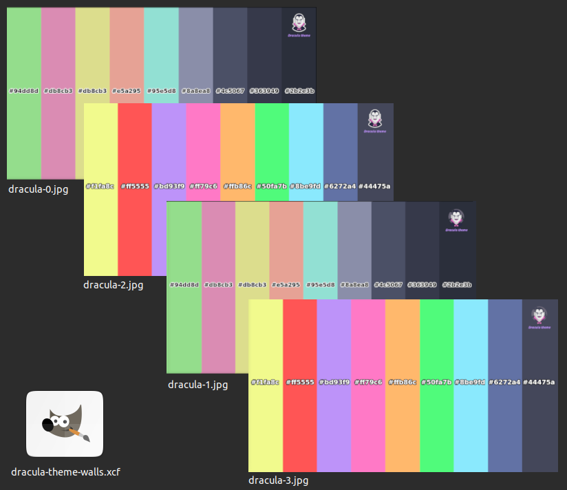

# Dracula for your Desktop

> A set of Dracula theme wallpapers for your Desktop.

## Install

Just set the desired image as your wallpaper.
- Wallpapers location: folder `/wallpapers`
- Size: `1920x1080`
- Format: `jpg`
- The color palette for: 
    - `dracula-0.jpg` and `dracula-1.jpg` is based on this [t-shirt](https://draculatheme.com/shop/hexadecimal-shirt)
    - `dracula-2.jpg` and `dracula-3.jpg` is based on this [color palette](https://draculatheme.com/contribute)
- The images were created using [Gimp](https://www.gimp.org/):
    - The file `dracula-theme.xcf` can be edited by **you** with `Gimp`.
    - `dracula-theme.xcf` has 9 [layers](https://docs.gimp.org/2.10/en/gimp-image-combining.html#gimp-concepts-layers) for you to play around and enjoy!
## Team

This theme is maintained by the following person: [Pauloba](https://github.com/pauloba)                                               

## Community

- [Twitter](https://twitter.com/draculatheme) - Best for getting updates about themes and new stuff.
- [GitHub](https://github.com/dracula/dracula-theme/discussions) - Best for asking questions and discussing issues.
- [Discord](https://draculatheme.com/discord-invite) - Best for hanging out with the community.

## License

[MIT License](./LICENSE)
